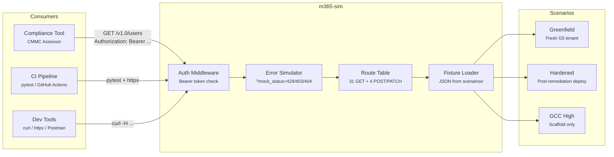
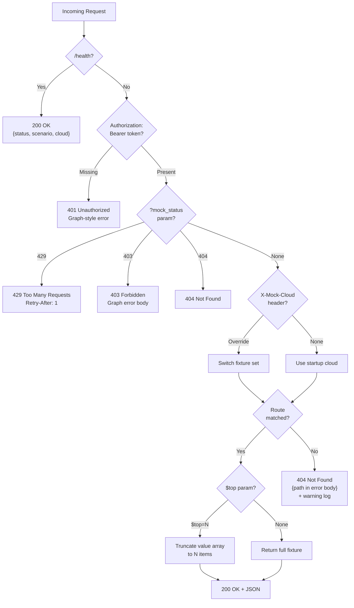
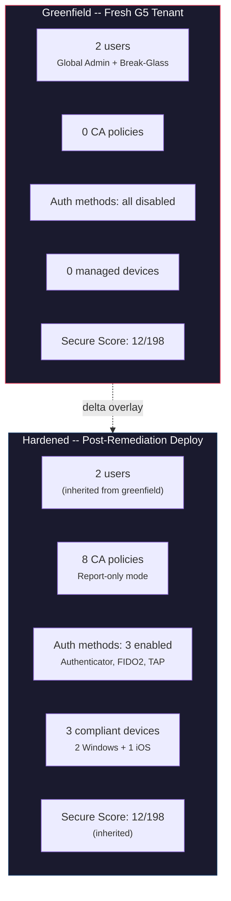
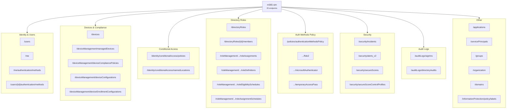
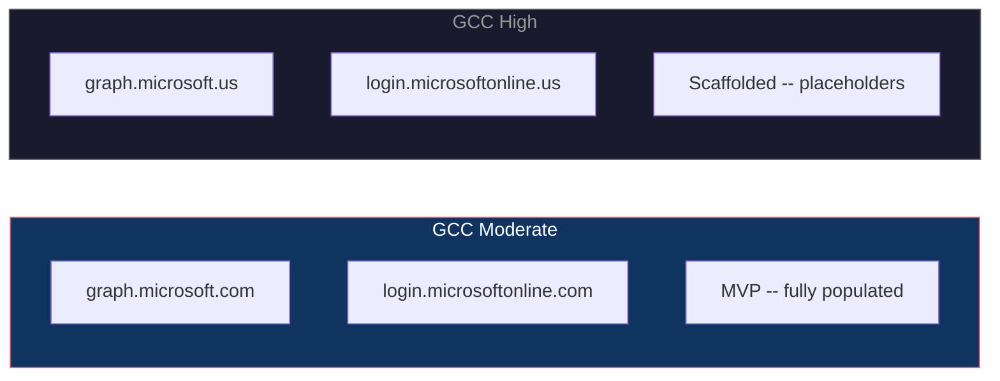

# m365-sim

**Microsoft Graph API simulation platform** for testing M365 compliance tools against realistic tenant state without a live tenant.

Designed for CMMC 2.0 L2 compliance assessment workflows. Usable by any M365 compliance or security tool that queries the Graph API.

---

## Why This Exists

M365 compliance tools often have integration tests gated behind live tenant access. Every evaluator accuracy fix requires manual live-tenant testing -- slow, risky, and not reproducible. m365-sim solves this:

- **All 25 integration tests runnable in CI** -- no live tenant needed
- **Evaluator accuracy iteration** -- tune evaluators against labeled ground truth
- **Reproducible bug reproduction** -- "here's the fixture that triggered this false Verified"
- **Safe write operation testing** -- CA policy creation, Intune enrollment against mock state
- **Multi-scenario testing** -- greenfield, hardened, partial tenant states

---

## Architecture



## Request Flow



---

## Quick Start

```bash
# Clone and install
git clone https://github.com/mmorris35/m365-sim.git
cd m365-sim
python3 -m venv .venv && source .venv/bin/activate
pip install -r requirements.txt

# Start the mock server
python server.py

# Query it
curl -H "Authorization: Bearer any-token" http://localhost:8888/v1.0/users
curl -H "Authorization: Bearer any-token" http://localhost:8888/v1.0/organization
```

## Usage

```bash
# Defaults: greenfield scenario, gcc-moderate cloud, port 8888
python server.py

# Hardened scenario (post-remediation deploy)
python server.py --scenario hardened

# Custom port
python server.py --port 9999

# GCC High cloud target
python server.py --cloud gcc-high

# Combine flags
python server.py --scenario hardened --cloud gcc-moderate --port 8080
```

### Integration

Point your compliance tool's Graph API client at the mock server:

```
GRAPH_BASE_URL=http://localhost:8888/v1.0
```

---

## Scenarios



| Scenario | Description | Expected SPRS Range | CA Policies | Devices |
|----------|-------------|:-------------------:|:-----------:|:-------:|
| `greenfield` | Fresh G5 GCC Moderate tenant, no controls deployed | -170 to -210 | 0 | 0 |
| `hardened` | Post-remediation deploy, report-only CA policies | -40 to -80 | 8 (report-only) | 3 (compliant) |
| `partial` | Mid-deployment state *(v2)* | -100 to -140 | -- | -- |

> **Note**: Hardened CA policies use `"state": "enabledForReportingButNotEnforced"` -- they are deployed but not enforced. CMMC compliance evaluators correctly reject report-only policies, so most AC objectives remain Deficient. This matches real-world initial remediation deploy state.

---

## Endpoint Coverage



### Write Endpoints (POST/PATCH)

| Method | Endpoint | Response |
|--------|----------|----------|
| `POST` | `/identity/conditionalAccess/policies` | 201 + body with generated `id` and `createdDateTime` |
| `PATCH` | `/policies/.../authenticationMethodConfigurations/{id}` | 200 + body unchanged |
| `POST` | `/deviceManagement/deviceCompliancePolicies` | 201 + body with generated `id` |
| `POST` | `/deviceManagement/deviceConfigurations` | 201 + body with generated `id` |

Write operations return realistic fake responses **without mutating fixture state**.

### Query Parameters

| Parameter | Behavior |
|-----------|----------|
| `$top=N` | Truncates `value` array to N items |
| `$filter` | Logged, ignored -- full fixture returned |
| `$select` | Logged, ignored -- full fixture returned |
| `$expand` | Logged, ignored -- full fixture returned |

### Error Simulation

Append `?mock_status=N` to any endpoint:

```bash
# Simulate rate limiting
curl -H "Authorization: Bearer x" "http://localhost:8888/v1.0/users?mock_status=429"
# Returns 429 with Retry-After: 1

# Simulate permission denied
curl -H "Authorization: Bearer x" "http://localhost:8888/v1.0/users?mock_status=403"
# Returns 403 with Graph-style error body

# Simulate not found
curl -H "Authorization: Bearer x" "http://localhost:8888/v1.0/users?mock_status=404"
```

---

## Cloud Targets



| Cloud | Graph URL | Auth URL | Status |
|-------|-----------|----------|--------|
| `gcc-moderate` | `graph.microsoft.com/v1.0` | `login.microsoftonline.com` | **Fully populated** |
| `gcc-high` | `graph.microsoft.us/v1.0` | `login.microsoftonline.us` | Scaffold only |

Override per-request with the `X-Mock-Cloud` header:

```bash
curl -H "Authorization: Bearer x" -H "X-Mock-Cloud: gcc-high" \
  http://localhost:8888/v1.0/users
```

---

## Project Structure

```
m365-sim/
├── server.py                              # Single-file FastAPI mock server
├── scenarios/
│   ├── gcc-moderate/
│   │   ├── greenfield/                    # Fresh G5 tenant (MVP)
│   │   │   ├── organization.json
│   │   │   ├── users.json
│   │   │   ├── conditional_access_policies.json
│   │   │   ├── secure_scores.json
│   │   │   └── ... (~27 fixture files)
│   │   ├── hardened/                      # Post-remediation deploy
│   │   │   ├── conditional_access_policies.json  # 8 report-only policies
│   │   │   ├── managed_devices.json              # 3 compliant devices
│   │   │   ├── auth_methods_policy.json          # 3 methods enabled
│   │   │   └── ...
│   │   └── partial/                       # Mid-deployment (v2)
│   └── gcc-high/
│       └── greenfield/                    # Placeholder fixtures
│           └── _README.md
├── builder/
│   └── tenant_builder.py                  # Fluent API for fixture generation
├── sdk/
│   └── __init__.py
├── tests/
│   ├── conftest.py                        # Subprocess server fixture
│   ├── test_server.py                     # Greenfield endpoint tests
│   ├── test_query_write_error.py          # Query params, writes, errors
│   ├── test_hardened.py                   # Hardened scenario tests
│   └── test_tenant_builder.py             # Builder tests
├── docs/
│   └── decisions.md                       # Design decision log
├── requirements.txt
├── PROJECT_BRIEF.md
└── DEVELOPMENT_PLAN.md
```

---

## TenantBuilder API

Generate fixture sets programmatically instead of hand-editing JSON:

```python
from builder.tenant_builder import TenantBuilder
from pathlib import Path

# Use a preset
TenantBuilder.greenfield_gcc_moderate().build(Path("scenarios/custom/my-test"))

# Or build custom scenarios
(TenantBuilder()
    .with_organization("Acme Corp", "acme.com")
    .with_user("Admin", "admin@acme.com", user_type="Member")
    .with_ca_policy("Require MFA", state="enabledForReportingButNotEnforced")
    .with_device("Laptop-01", os="Windows", compliance_state="compliant")
    .with_secure_score(current_score=45.0, max_score=198.0)
    .build(Path("/tmp/acme-fixtures")))
```

---

## Testing

```bash
# Run all tests
pytest tests/ -v

# Greenfield tests only
pytest tests/test_server.py -v

# Hardened scenario tests
pytest tests/test_hardened.py -v

# Query param / write / error tests
pytest tests/test_query_write_error.py -v
```

All tests use a **subprocess server** -- no mocking, real HTTP requests via httpx.

---

## Auth

m365-sim accepts **any** `Authorization: Bearer <token>` header without validation. If the header is missing entirely, it returns HTTP 401 with a Graph-style error body. This matches the minimal auth surface needed for integration testing.

---

## Roadmap

- [x] GCC Moderate greenfield scenario
- [x] GCC Moderate hardened scenario
- [x] GCC High scaffold
- [x] TenantBuilder fluent API
- [ ] Partial scenario (mid-deployment state)
- [ ] OSCAL Component Definition generation
- [ ] Stateful write operations
- [ ] Commercial E5 cloud target
- [ ] Hot-reload fixtures without restart
- [ ] Docker packaging for CI
- [ ] Integration test harness (SPRS score assertions)

---

## License

Apache 2.0
